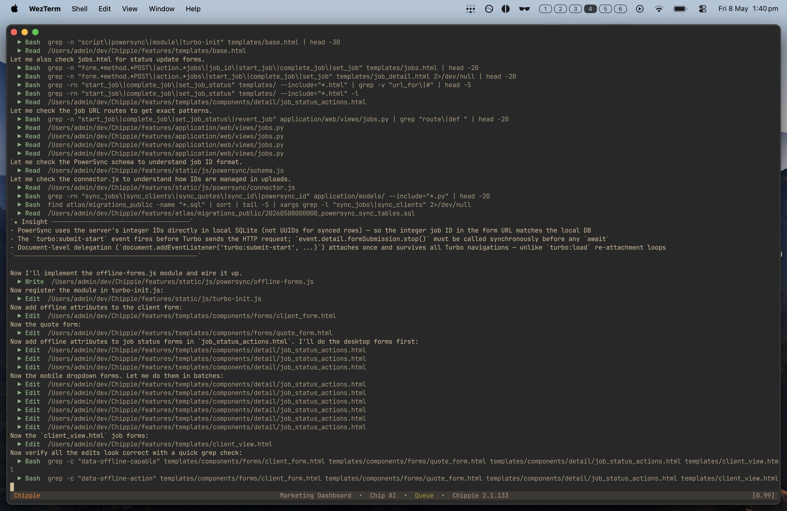

# Sutra

A sequential AI orchestration layer built on Claude Code (via `claude -p`) and beads.
A bash outer loop feeds tasks to Claude Code one at a time — claim a task, invoke the
model, check the result, repeat. ~5,300 lines of bash across ~35 library files in `lib/`.

The premise (see [PHILOSOPHY.md](./PHILOSOPHY.md)): simple deterministic orchestration
plus a smart model beats clever multi-agent systems. All the intelligence lives in
Claude; the outer loop is a for-loop with a sort.



## Two Modes

- **Playlist mode** (primary) — execute a hand- or Claude-authored list of beads,
  free-form prompts, and quality gates in order: `./sutra --playlist plan.playlist`
- **Standard mode** — pull the next unblocked bead from `br ready` and work it:
  `./sutra`

## Queue

Run multiple playlists back-to-back with `./sutra --queue queue.txt`. The queue file
lists playlist paths one per line; each entry spawns a fresh child run with its own
session, branch, logs, and completion report. The queue is resumable — an interrupted
run picks up at the entry it stopped on instead of restarting.

## Quick Start

```bash
./sutra --init                          # scaffold .sutra/config
./sutra --dry-run --playlist plan.playlist   # validate without executing
./sutra --playlist plan.playlist        # run it
./sutra --monitor                       # live dashboard (separate terminal)
./sutra --status                        # inspect run state
```

Per-project defaults live in `.sutra/config`; CLI flags override them. See
[GUIDE.md](./GUIDE.md) for the full operational guide and `./sutra --help` for all flags.

## Prerequisites

`br` (beads_rust issue tracker), the `claude` CLI, `jq`, and `timeout`/`gtimeout`.
Checked at startup by `lib/prereqs.sh`.

## How It Works

Each iteration: select a task, build a prompt from templates, invoke `claude -p` with
a timeout, check whether the bead's status changed, and update a circuit breaker.
Safety rails include per-run cost caps, model auto-escalation on retry
(haiku → sonnet → opus), and a circuit breaker that halts after repeated no-progress.
Playlist state is crash-safe — a run resumes at the line it failed on.

## Documentation

| Document | Purpose |
|----------|---------|
| [PHILOSOPHY.md](./PHILOSOPHY.md) | Founding principles — read first |
| [GUIDE.md](./GUIDE.md) | Complete operational guide |
| [CLAUDE.md](./CLAUDE.md) | Architecture and coding-style reference |
| [PLAN.md](./PLAN.md) | Build-order checklist |
| [CREDITS.md](./CREDITS.md) | Prior works Sutra builds on |
